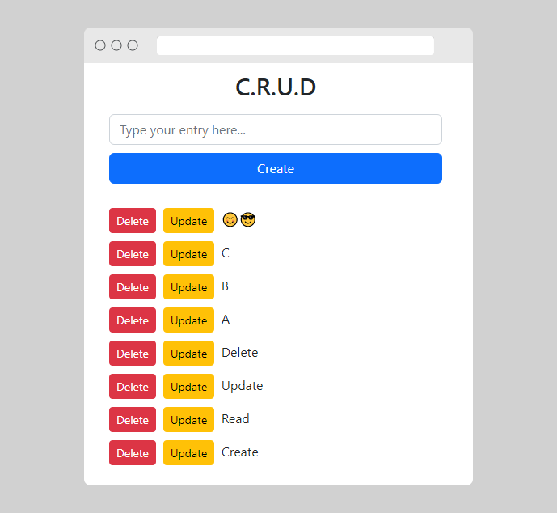

# Pocketbase C.R.U.D
An example of a Create, Read, Update, Delete (CRUD) web app themed with [bootstrap](https://getbootstrap.com/) and using the  [pocketbase](https://github.com/pocketbase/pocketbase) backend.

## Resources
- [Icon](https://www.icons101.com/icon/id_83391/setid_3024/Geoit_Two_Dock_Icons_by_turkerinanmaz/Notes)
- [Screely](https://www.screely.com/)
